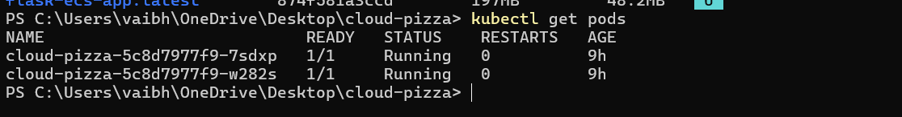
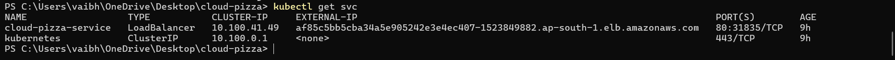
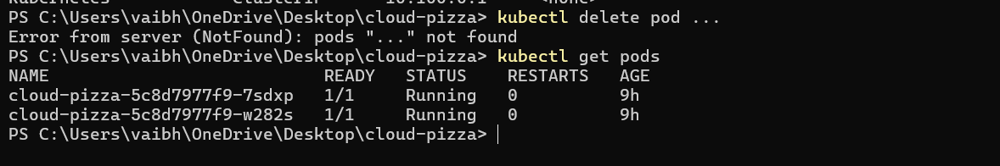

# Cloud Pizza Factory 🍕

A scalable cloud-native web application deployed on AWS using Docker and Kubernetes.

## Project Overview

This project demonstrates end-to-end deployment of a Python Flask application using containerization and orchestration on AWS.

The application was:

* Built using Python Flask
* Containerized using Docker
* Stored in Amazon ECR
* Deployed on Amazon EKS
* Managed using Kubernetes Deployment
* Exposed publicly using AWS Load Balancer
* Tested for Scaling and Self-Healing

---

## Architecture

```text
User Browser
      │
      ▼
AWS Load Balancer
      │
      ▼
Kubernetes Service
      │
      ▼
Amazon EKS Cluster
      │
      ▼
Kubernetes Pods
      │
      ▼
Docker Image from Amazon ECR
      │
      ▼
Flask Application
```

---

## Tech Stack

* Python
* Flask
* Docker
* Kubernetes
* AWS ECR
* AWS EKS
* EC2
* Elastic Load Balancer
* IAM
* AWS CLI
* kubectl
* eksctl

---

## Features

✅ Docker Containerization
✅ Kubernetes Deployment
✅ AWS ECR Integration
✅ AWS EKS Cluster Deployment
✅ Load Balancer Public Access
✅ Horizontal Scaling
✅ Self-Healing Demonstration
✅ Cloud Infrastructure Debugging

---

## Project Workflow

```text
Flask App
   ↓
Docker Build
   ↓
Push Image to Amazon ECR
   ↓
Create Amazon EKS Cluster
   ↓
Deploy using deployment.yaml
   ↓
Expose using service.yaml
   ↓
Scale Pods
   ↓
Self Healing Demonstration
```

---

## Screenshots

### Architecture Diagram


### Application Running


### Kubernetes Pods Running



### Load Balancer Public URL



### Self Healing Demo



## Commands Used

```bash
docker build -t cloud-pizza .

docker push <ECR_URL>

eksctl create cluster --name pizza-cluster --region ap-south-1 --node-type t3.small --nodes 1

kubectl apply -f deployment.yaml

kubectl apply -f service.yaml

kubectl scale deployment cloud-pizza --replicas=2

kubectl delete pod <pod-name>
```

---

## Learning Outcomes

* Docker Image Creation
* AWS ECR Image Registry
* AWS EKS Cluster Management
* Kubernetes Deployments
* Service Exposure using LoadBalancer
* Scaling Applications
* Kubernetes Self-Healing
* Debugging Cloud Infrastructure

```
```
